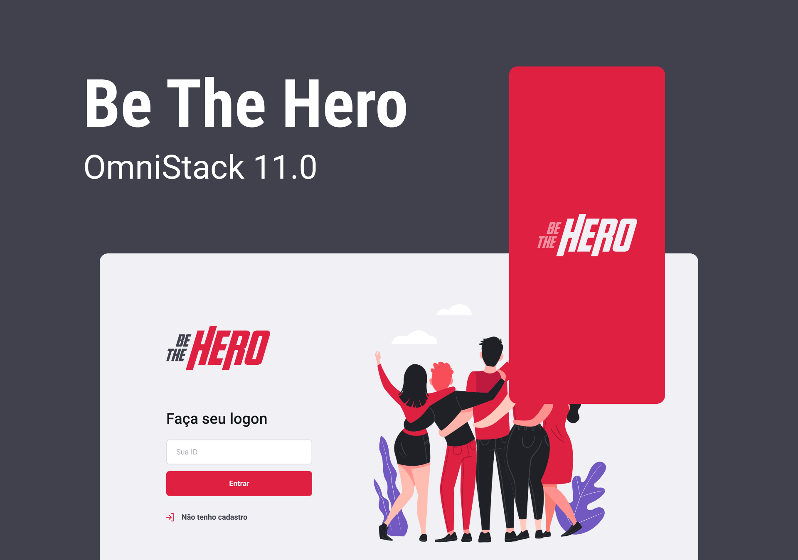

<h1 align="center">
    
</h1>


## 💻 Project

Be The Hero is an app to connect people who want to help ONGs.

<h1 align="center">
    
</h1>


## :rocket: Technologies

This project was developed with the following technologies:

- [Node.js](https://nodejs.org/en/) 
- [React](https://reactjs.org)
- [React Native](https://facebook.github.io/react-native/)
- [Expo](https://expo.io/)


## :information_source: How To Use

To clone and run this application, you'll need [Git](https://git-scm.com), [Node.js][nodejs] + [Yarn][yarn] installed on your computer.

From your command line:

### Install API
```bash
# Clone this repository
$ git clone https://github.com/ViniCleFer/BeTheHero.git

# Go into the repository
$ cd BeTheHero/backend

# Install dependencies
$ yarn install

# Run Migrates
$ yarn knex migrate:latest 

# Run Seeds
$ yarn seed

# Run the API
$ yarn start

# Run tests
$ yarn test
```

[nodejs]: https://nodejs.org/
[yarn]: https://yarnpkg.com/
[vc]: https://code.visualstudio.com/
[vceditconfig]: https://marketplace.visualstudio.com/items?itemName=EditorConfig.EditorConfig
[vceslint]: https://marketplace.visualstudio.com/items?itemName=dbaeumer.vscode-eslint
[prettier]: https://marketplace.visualstudio.com/items?itemName=esbenp.prettier-vscode